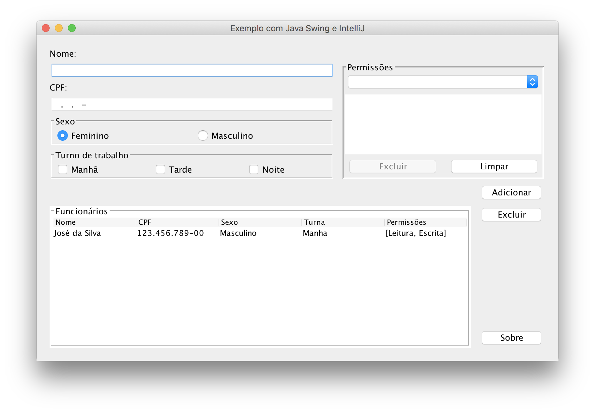

# Exemplo de aplicação com interfáce gráfica amigável em Swing

Nessa aplicação, feita com IntelliJ, são apresentados alguns componentes do Java Swing, seus eventos e propriedades. A aplicação é um esqueleto funcional (projeto gradle para IntelliJ), ou seja, algumas partes precisam ser finalizadas.

